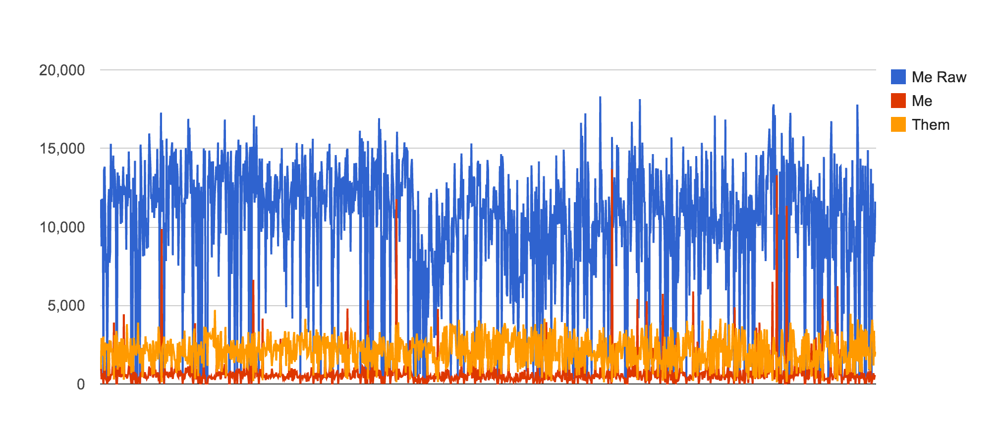

# Level 4

I actually implemented two solutions to this level.  The first was a purely
cheating solution, and the second was the solution that the folks at Stripe 
intended for us to implement.

## Solution 1

My cheating solution (source not present) would just proxy any request that
came to any of the nodes over to the master.  I realized this solution would
work once I noticed that the master node was never being terminated during
the test, only cut off temporarily from the network.  This meant that I could
easily have it just keep the state of the database on its disk and just block
each of the workers until the master was around to answer.

This worked reasonable well and I was able to get a passing score with no
problems.  After thinking about this solution for awhile and observing the
logs of some of my runs, I did have one epiphany that helped my solution to be
a bit faster.  Namely that is that the queries that the test harness would send
to the nodes were incredibly predictable.  They were always just updating one
row of the database and then selecting the entire contents of the database.

So in order to take advantage of this I completely replaced sqlite and instead
built a really dumb in-memory database of my own.  I parsed each query using a
regular expression and executed it by updating my in-memory copy of things.
Then I translated the in-memory copy into a string that was in the format that
the test harness was expected (including replicating sqlite errors for when a
table we created twice in a row).  This completely eliminated having to fork any
child processes during a run and definitely made my solution a bit faster.  

Finally one other optimization I made was for proxied requests that I would be
sending from a worker to the master, I just sent an already parsed version of
the query.  That limited the number of bytes that I sent over the network so as
to reduce penalties.  I also tried gzipping the payloads going in both
directions but that didn't really help since the data was small to begin with.
In most cases it actually made the data bigger.  With this code I was able to 
get to #1 on the leaderboard a couple of times.

## Solution 2

As most people know by now during the middle of the contest, Stripe figured out
exactly what people like me were doing, and to compensate they introduced a
SPOF monkey into octopus.  The SPOF monkey was clever, it would remove all
network from a node at a random point in time, and make sure that the 
remaining nodes would still be able to answer queries successfully without the
removed node.  If they could, then the removed node would be added back and in
the future another node would be tested.  This meant that you actually had to
solve the consensus problem that they originally wanted you to solve.

Fortunately I have some pretty deep experience with ZooKeeper, so I was well
aware of the concepts involved in consensus and sufficiently scared of the
complexity and edge cases involved that I didn't want to write my own 
implementation.  ZooKeeper wasn't going to be an option because of the unix
socket limitation.  It was quite clear that it would be too much work and take
too long to figure out how to make everything compatible with unix sockets so
I opted to give raft a shot instead.  I had heard of raft and knew that it was
a simpler protocol compared to Paxos, and knew that the primary implementation
was written in Go.  So I opted to use that.

There's nothing terribly interesting about the code in my second solution, I
used the goraft code almost verbatim and did all of the annoying work to 
integrate it into the server code that we were given.  One side note is that I
found the reference server implementation that Stripe gave us to be horrible.  I
opted to completely gut it and rewrite it with just the pieces that I felt were
necessary.

In the end I basically had the same implementation as pretty much everyone else
who integrated raft into their code.  I should also note that I kept my 
in-memory database implementation as well as forwarding parsed query 
optimizations from my first solution.

## Getting to the top of the leaderboard

So how did I get so high on the leaderboard with an implementation that was
probably quite similar to what pretty much everyone else had?  Well this is
just where I started to game another aspect of the system.  If you look at the
way that scores were computed, your score was basically a ratio of how well your
code performed on a given test compared to the reference implementation that
Stripe wrote.  So you score will be really high if you either do exceptionally
well on a given test case *OR* if Stripe's reference implementation did 
exceptionally poorly.  Since my theory is that most of us had incredibly similar
implementations, the only real way to get ahead would be to get your code to
run on tests where Stripe's solution did poorly.  So I basically just started to
run my code in a loop over and over.  This became an exercise in trying to get
as many runs as possible before the competition ended.

I graphed some of the raw data of my runs with my raw score, Stripe's raw score,
and the ratio between them:

As you can see by the small red spikes there were very infrequent inputs where
my code would just get an unusually high score -- but those red spikes aren't
correlated with equivalently high spikes in the blue curve.  So it was clear
that the Stripe score had to be ridiculously low.  In fact on my best score, my
code received a score of 15,724 while Stripe's only received a score of 115.
Doing the normalization math `(15,724/115) * 100` yields a score of 13,673 which
was good enough for 2nd place.

Finally, to be fair, I did to a little bit of tweaking of the raft code to try
to make it marginally faster.  I don't really think it helped too much in the
long run, but I did do things like remove the fsync calls they had for the
transaction log since I knew my server was never going to die.  I didn't care 
at all about durability of the data.  I also tuned some of the election and
heartbeat times in hopes of finding a good balance between speed and network
penalty.
